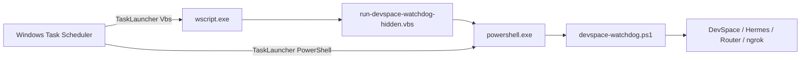

# Windows Watchdog Task Launcher Guide

[繁體中文](windows-watchdog-task-launcher.zh-TW.md)

The Windows watchdog installer supports two Scheduled Task launchers:

- `Vbs` — Task Scheduler starts `wscript.exe`, which runs the hidden VBS launcher and then PowerShell.
- `PowerShell` — Task Scheduler starts `powershell.exe` directly.

The launcher choice is independent from the task privilege level. `-UserMode` still creates a `Limited` task, while administrator mode creates a `Highest` task.

## Architecture



## Which launcher should I use?

| Environment | Recommended launcher | Reason |
| --- | --- | --- |
| Personal computer without endpoint restrictions | `Vbs` | Hidden launcher avoids a visible console window. |
| Corporate computer with Kaspersky or another EDR rule that blocks VBScript starting PowerShell | `PowerShell` | Uses a shorter, more transparent process chain. |
| Windows Script Host disabled by policy | `PowerShell` | Does not require `wscript.exe` or VBScript. |
| PowerShell directly blocked by policy | Neither launcher will work | Both launchers ultimately run the PowerShell watchdog. Ask IT for an approved rule. |

The generic installer defaults to `Vbs` for backward compatibility. The TYO helper installers default to `PowerShell` because the tested Kaspersky policy blocks the VBS-to-PowerShell chain.

## Install with direct PowerShell

Use this on a corporate machine where the VBS launcher is blocked:

```powershell
powershell.exe -ExecutionPolicy Bypass -File .\scripts\windows\install-devspace-watchdog.ps1 `
  -UserMode `
  -TaskLauncher PowerShell `
  -Components DevSpace,Hermes `
  -AllowedRoots "D:\projects" `
  -PublicBaseUrl "https://your-stable-domain.ngrok-free.dev"
```

The resulting Scheduled Task action is similar to:

```text
powershell.exe -NoProfile -ExecutionPolicy Bypass -WindowStyle Hidden \
  -File "%USERPROFILE%\.devspace\devspace-watchdog.ps1" \
  -Once \
  -ConfigPath "%USERPROFILE%\.devspace\devspace-watchdog.config.json"
```

## Install with the hidden VBS launcher

```powershell
powershell.exe -ExecutionPolicy Bypass -File .\scripts\windows\install-devspace-watchdog.ps1 `
  -UserMode `
  -TaskLauncher Vbs `
  -Components DevSpace,Hermes `
  -AllowedRoots "D:\projects" `
  -PublicBaseUrl "https://your-stable-domain.ngrok-free.dev"
```

The resulting Scheduled Task action is:

```text
wscript.exe "%USERPROFILE%\.devspace\run-devspace-watchdog-hidden.vbs" -Once
```

## TYO helper installer

The TYO helper defaults to direct PowerShell:

```powershell
powershell.exe -ExecutionPolicy Bypass -File .\scripts\windows\install-devspace-chatgpt-tyo-agent.ps1
```

Override it only when the endpoint policy allows the VBS chain:

```powershell
powershell.exe -ExecutionPolicy Bypass -File .\scripts\windows\install-devspace-chatgpt-tyo-agent.ps1 `
  -TaskLauncher Vbs
```

## Verify the installed launcher

```powershell
$taskName = "DevSpaceNgrokWatchdogUserPoller"
$task = Get-ScheduledTask -TaskName $taskName

$task | Select-Object TaskName, State,
  @{Name="RunLevel";Expression={$_.Principal.RunLevel}},
  @{Name="LogonType";Expression={$_.Principal.LogonType}}

$task.Actions | Format-List Execute, Arguments
```

Expected direct PowerShell output:

```text
Execute   : powershell.exe
Arguments : -NoProfile ... -File "...\devspace-watchdog.ps1" ...
```

Expected VBS output:

```text
Execute   : wscript.exe
Arguments : "...\run-devspace-watchdog-hidden.vbs" -Once
```

## Verify the watchdog after installation

Run the task once and inspect its result:

```powershell
Start-ScheduledTask -TaskName "DevSpaceNgrokWatchdogUserPoller"
Start-Sleep -Seconds 10
Get-ScheduledTaskInfo -TaskName "DevSpaceNgrokWatchdogUserPoller" |
  Select-Object LastRunTime, LastTaskResult, NextRunTime
```

Check the local ports:

```powershell
Get-NetTCPConnection -State Listen |
  Where-Object LocalPort -in 4750,7676,8765 |
  Sort-Object LocalPort |
  Format-Table LocalAddress,LocalPort,OwningProcess
```

Typical ports are:

- `4750` — Hermes MCP
- `7676` — DevSpace MCP
- `8765` — shared MCP router

## Switch an existing installation

Rerun the same installer command with the desired `-TaskLauncher` value. The installer recreates the watchdog task using the selected action.

Before changing a remote-only machine, export the current task:

```powershell
schtasks.exe /Query /TN "DevSpaceNgrokWatchdogUserPoller" /XML |
  Set-Content "$env:USERPROFILE\Desktop\devspace-watchdog-backup.xml" -Encoding Unicode
```

Change one machine at a time and verify both DevSpace and Hermes MCP connectivity before changing the next machine.

## Roll back

To return to direct PowerShell, rerun the installer with:

```powershell
-TaskLauncher PowerShell
```

To return to VBS, rerun it with:

```powershell
-TaskLauncher Vbs
```

If the Scheduled Task cannot start, run the watchdog directly:

```powershell
powershell.exe -NoProfile -ExecutionPolicy Bypass -WindowStyle Hidden `
  -File "$env:USERPROFILE\.devspace\devspace-watchdog.ps1" `
  -Once `
  -ConfigPath "$env:USERPROFILE\.devspace\devspace-watchdog.config.json"
```

## Kaspersky troubleshooting

A Kaspersky Endpoint Security policy may allow direct PowerShell but block this behavior chain:

```text
VBScript / Windows Script Host -> PowerShell
```

Common symptoms are:

- `Microsoft VBScript runtime error: Permission denied`
- Kaspersky events indicating that VBScript attempted to start PowerShell
- The Scheduled Task runs, but the PowerShell watchdog never starts

Use `-TaskLauncher PowerShell` when this policy is active. Do not exclude all of `powershell.exe`, `wscript.exe`, or the entire user profile from endpoint protection. Prefer a narrowly scoped, IT-approved rule for the fixed DevSpace script paths when an exception is required.

## Test the launcher command generator

On Windows:

```powershell
npm run test:windows-watchdog
```

This test validates both command forms, including paths containing spaces, without registering or starting a Scheduled Task.
