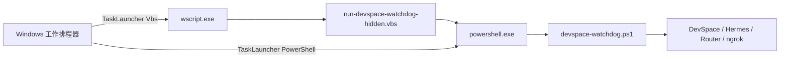

# Windows Watchdog 排程啟動器使用說明

[English](windows-watchdog-task-launcher.md)

Windows Watchdog 安裝程式現在支援兩種 Scheduled Task 啟動方式：

- `Vbs`：工作排程器先啟動 `wscript.exe`，再由隱藏 VBS 啟動 PowerShell。
- `PowerShell`：工作排程器直接啟動 `powershell.exe`。

啟動器和權限層級是兩個獨立設定。使用 `-UserMode` 仍會建立 `Limited` 排程；以系統管理員模式安裝則會建立 `Highest` 排程。

## 架構圖



## 該選哪一種？

| 使用環境 | 建議啟動器 | 原因 |
| --- | --- | --- |
| 沒有企業端點限制的個人電腦 | `Vbs` | 隱藏啟動，可避免主控台視窗閃爍。 |
| Kaspersky 或其他 EDR 會封鎖 VBScript 啟動 PowerShell 的公司電腦 | `PowerShell` | 程序鏈較短，也比較容易稽核。 |
| 公司政策停用 Windows Script Host | `PowerShell` | 不需要 `wscript.exe` 或 VBScript。 |
| 公司政策直接封鎖 PowerShell | 兩種都無法使用 | 兩種最後都會執行 PowerShell Watchdog，需要請 IT 建立核准規則。 |

一般安裝程式為了向下相容，預設仍是 `Vbs`。TYO 專用安裝腳本則預設為 `PowerShell`，因為實測的 Kaspersky 政策會封鎖 VBS 啟動 PowerShell 的行為鏈。

## 使用直接 PowerShell 安裝

公司電腦的 VBS 啟動器若被封鎖，使用：

```powershell
powershell.exe -ExecutionPolicy Bypass -File .\scripts\windows\install-devspace-watchdog.ps1 `
  -UserMode `
  -TaskLauncher PowerShell `
  -Components DevSpace,Hermes `
  -AllowedRoots "D:\projects" `
  -PublicBaseUrl "https://your-stable-domain.ngrok-free.dev"
```

建立出的排程動作會類似：

```text
powershell.exe -NoProfile -ExecutionPolicy Bypass -WindowStyle Hidden \
  -File "%USERPROFILE%\.devspace\devspace-watchdog.ps1" \
  -Once \
  -ConfigPath "%USERPROFILE%\.devspace\devspace-watchdog.config.json"
```

## 使用隱藏 VBS 啟動器安裝

```powershell
powershell.exe -ExecutionPolicy Bypass -File .\scripts\windows\install-devspace-watchdog.ps1 `
  -UserMode `
  -TaskLauncher Vbs `
  -Components DevSpace,Hermes `
  -AllowedRoots "D:\projects" `
  -PublicBaseUrl "https://your-stable-domain.ngrok-free.dev"
```

建立出的排程動作是：

```text
wscript.exe "%USERPROFILE%\.devspace\run-devspace-watchdog-hidden.vbs" -Once
```

## TYO 專用安裝腳本

TYO helper 現在預設使用直接 PowerShell：

```powershell
powershell.exe -ExecutionPolicy Bypass -File .\scripts\windows\install-devspace-chatgpt-tyo-agent.ps1
```

只有在端點防護確定允許 VBS 啟動 PowerShell 時，才改用：

```powershell
powershell.exe -ExecutionPolicy Bypass -File .\scripts\windows\install-devspace-chatgpt-tyo-agent.ps1 `
  -TaskLauncher Vbs
```

## 確認目前安裝的是哪一種啟動器

```powershell
$taskName = "DevSpaceNgrokWatchdogUserPoller"
$task = Get-ScheduledTask -TaskName $taskName

$task | Select-Object TaskName, State,
  @{Name="RunLevel";Expression={$_.Principal.RunLevel}},
  @{Name="LogonType";Expression={$_.Principal.LogonType}}

$task.Actions | Format-List Execute, Arguments
```

直接 PowerShell 預期結果：

```text
Execute   : powershell.exe
Arguments : -NoProfile ... -File "...\devspace-watchdog.ps1" ...
```

VBS 預期結果：

```text
Execute   : wscript.exe
Arguments : "...\run-devspace-watchdog-hidden.vbs" -Once
```

## 安裝後確認 Watchdog

手動執行一次排程並查看結果：

```powershell
Start-ScheduledTask -TaskName "DevSpaceNgrokWatchdogUserPoller"
Start-Sleep -Seconds 10
Get-ScheduledTaskInfo -TaskName "DevSpaceNgrokWatchdogUserPoller" |
  Select-Object LastRunTime, LastTaskResult, NextRunTime
```

檢查本機服務連接埠：

```powershell
Get-NetTCPConnection -State Listen |
  Where-Object LocalPort -in 4750,7676,8765 |
  Sort-Object LocalPort |
  Format-Table LocalAddress,LocalPort,OwningProcess
```

常用連接埠：

- `4750`：Hermes MCP
- `7676`：DevSpace MCP
- `8765`：共用 MCP Router

Watchdog 也會檢查 `http://127.0.0.1:4750/mcp`。像 `406 Not Acceptable` 這種快速的 MCP 回應代表服務正常；若請求逾時，Watchdog 會停止卡死的 Hermes 程序並重新啟動。

## 切換既有安裝

使用原本相同的安裝參數重新執行 installer，只要把 `-TaskLauncher` 改成需要的值。安裝程式會用指定啟動器重建 Watchdog 排程。

如果電腦主要靠遠端 MCP 管理，變更前先匯出現有排程：

```powershell
schtasks.exe /Query /TN "DevSpaceNgrokWatchdogUserPoller" /XML |
  Set-Content "$env:USERPROFILE\Desktop\devspace-watchdog-backup.xml" -Encoding Unicode
```

一次只修改一台；確認 DevSpace 和 Hermes MCP 都能連線後，再修改下一台。

## 復原方式

改回直接 PowerShell：

```powershell
-TaskLauncher PowerShell
```

改回 VBS：

```powershell
-TaskLauncher Vbs
```

如果工作排程無法啟動，可直接執行 Watchdog：

```powershell
powershell.exe -NoProfile -ExecutionPolicy Bypass -WindowStyle Hidden `
  -File "$env:USERPROFILE\.devspace\devspace-watchdog.ps1" `
  -Once `
  -ConfigPath "$env:USERPROFILE\.devspace\devspace-watchdog.config.json"
```

## Kaspersky 疑難排解

某些 Kaspersky Endpoint Security 政策會允許直接 PowerShell，但封鎖以下行為鏈：

```text
VBScript / Windows Script Host -> PowerShell
```

常見症狀：

- `Microsoft VBScript runtime error: Permission denied`
- Kaspersky 事件顯示 VBScript 嘗試啟動 PowerShell
- 排程有執行，但 PowerShell Watchdog 沒有真正啟動

遇到這種政策時，使用 `-TaskLauncher PowerShell`。不要把整個 `powershell.exe`、`wscript.exe` 或整個使用者目錄加入防毒排除；若真的需要例外，應請 IT 只針對固定 DevSpace 腳本路徑建立範圍最小的核准規則。

## 測試啟動命令產生器

在 Windows 執行：

```powershell
npm run test:windows-watchdog
```

這項測試會驗證兩種命令格式，包含路徑中有空白的情況，但不會建立或啟動真正的 Scheduled Task。
